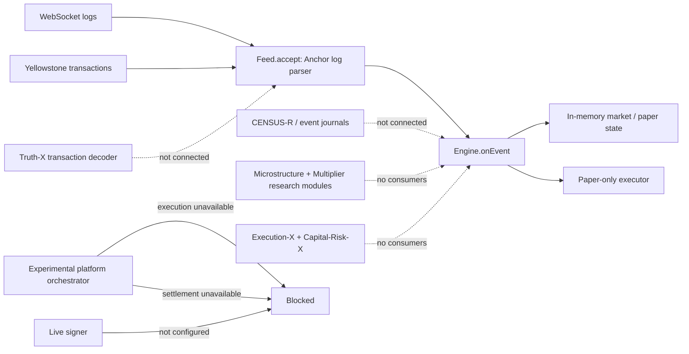

# SYLPH FUSION — ARCHITECTURE GAPS & REMEDIATION STATUS

**Assessment Date:** 2026-09-28T02:47:36Z
**Document Status:** Living Master Engineering Record
**Target Architecture:** Fail-Closed, Evidence-Driven Solana Token-Intelligence and Trading Engine
**Verification Baseline:** Historical test count; current tests are run separately and do not constitute production certification.

This document is an implementation inventory with locally cited tests, not a verified closure record for the 105-section blueprint. Unit tests do not establish runtime integration, production evidence, or release readiness. The authoritative release state remains **PRODUCTION RELEASE BLOCKED**; see `RELEASE_CERTIFICATION.md`. Claims below require independent source and end-to-end verification before they can be treated as closed.

## Current end-to-end blockers observed in source

These are integration findings from the active runtime path, not a complete re-audit of every historical inventory row:

1. **Transaction truth is not on the decision path.** `src/feed.ts` accepts signature, slot, and logs; Yellowstone forwards `meta.logMessages`, while WSS is log-based. `src/platform/ingestion/truth-x.ts` has no runtime consumer. The current feed therefore does not prove exact serialized-message binding, complete transaction metadata, bank ancestry, or fork rollback before `src/fusion.ts` updates market state.
2. **The blueprint's production spine is incomplete.** Event journal, CENSUS-R, transaction truth, economic deltas, point-in-time state, model evaluation, and execution are present as separate modules, but the new Truth-X, Execution-X, Capital-Risk-X, Microstructure-X, and Multiplier-X modules are not consumed by the primary `Feed`/`Engine` path.
3. **Economic execution and settlement are intentionally unavailable.** `src/platform/orchestrator.ts` returns `ECONOMIC_EXECUTION_UNAVAILABLE` before execution effects and `ECONOMIC_SETTLEMENT_UNAVAILABLE` before settlement effects. These guards are correct containment, not completed production functionality.
4. **The core binary remains paper-only.** `src/fusion.ts` rejects live startup and reports `LIVE_SIGNING_UNAVAILABLE` without an isolated durable signer. A research certificate or passing test cannot enable live authority.
5. **Caller assertions are not release evidence.** The Alpha Court and release-gate helper must only report research results until evidence artifacts are independently validated and tied to a specific release. Their outputs are not production certificates.

Required implementation order remains: durable raw observation envelope → transaction decoding and economic deltas → fork-aware canonical journal and replay → point-in-time feature integration → validated research/model evidence → opportunity and risk certificates → durable capital/account/settlement reservations → exact-message signing service → landing, settlement, and wallet reconciliation. Keep broadcast blocked until that complete chain is independently verified.

### Observed runtime architecture (not the target architecture)

---

## 1. Critical Priority (P0) Implementation Inventory — Not Release-Certified

### P0-1: CENSUS-R Canonical Event Journal & Fork Awareness (Sections 9 & 10)
- **Status:** **IMPLEMENTATION / TEST EVIDENCE ONLY — RELEASE NOT CERTIFIED**
- **Implementation:** `src/platform/ingestion/census-r.ts`
- **Verification:** `test/platform/census-r.test.mjs` (3/3 pass)
- **Evidence:** Bank/fork-aware append-only event journal with canonical event IDs (`<slot>:<bank_hash>:<tx_hash>:<event_idx>`), 4-stage event lifecycle (`RAW -> OBSERVED -> CANONICAL -> SEALED`), atomic transaction-level batch commits/rollbacks, late-event non-destructive repair, and fork unwinding.

### P0-2: Exact Final Execution Witness & StateLease Authority (Sections 31, 32, 33)
- **Status:** **IMPLEMENTATION / TEST EVIDENCE ONLY — RELEASE NOT CERTIFIED**
- **Implementation:** `src/platform/execution/execution-witness.ts`
- **Verification:** `test/platform/execution-witness.test.mjs` (3/3 pass), `test/adversarial-chaos.test.mjs:NEMESIS-009` (pass)
- **Evidence:** Enforces strict linear progression `BUILT -> SIMULATED -> HASHED -> AUTHORIZED -> SIGNED -> BROADCAST`. Binds exact message hash, blockhash, compute unit limits, Address Lookup Table (ALT) content hashes, `CapitalEnvelopeCertificate`, and `ExecutionStateLease`. Account state drift or ALT modification immediately invalidates the witness and fails closed.

### P0-3: Signer Bastion, KMS Signing State Machine & FENCEGRID (Sections 39, 40, 42)
- **Status:** **IMPLEMENTATION / TEST EVIDENCE ONLY — RELEASE NOT CERTIFIED**
- **Implementation:** `src/platform/signing/durable-live-signer.ts`, `src/platform/control/command-seal.ts`
- **Verification:** `test/platform/kms-signing-statemachine.test.mjs` (3/3 pass), `test/platform/command-seal.test.mjs` (3/3 pass), `test/adversarial-chaos.test.mjs:NEMESIS-001`, `NEMESIS-007` (pass)
- **Evidence:** 3-state KMS state machine (`PREPARED -> SIGNING_IN_FLIGHT -> SIGNED`), durable persistence prior to KMS dispatch, ambiguous crash lock (`RECOVERY_AMBIGUOUS`), zero plaintext private key fallback, and distributed `FENCEGRID` `FenceEpoch` validation rejecting stale or partitioned nodes.

### P0-4: STARTSEAL Reconcile-First Startup & Inventory Census (Section 20)
- **Status:** **IMPLEMENTATION / TEST EVIDENCE ONLY — RELEASE NOT CERTIFIED**
- **Implementation:** `src/platform/lifecycle/start-seal.ts`
- **Verification:** `test/platform/start-seal.test.mjs` (3/3 pass), `test/adversarial-chaos.test.mjs:NEMESIS-003` (pass)
- **Evidence:** Strict 12-stage sequential startup sequence (`BOOT -> ... -> REDUCE_ONLY -> ENTRY_READY`). Whole-wallet inventory census queries all native SOL, SPL, and Token-2022 accounts, detects external drift or unsolicited transfers, and preserves local reconciliation integrity.

### P0-5: LOTROOT Fill-Based Position Accounting & Conservation Invariant (Section 21)
- **Status:** **IMPLEMENTATION / TEST EVIDENCE ONLY — RELEASE NOT CERTIFIED**
- **Implementation:** `src/platform/ledger/lot-root.ts`
- **Verification:** `test/platform/lot-root.test.mjs` (3/3 pass), `test/adversarial-chaos.test.mjs:NEMESIS-004` (pass)
- **Evidence:** Discrete immutable `PositionLot` structures supporting `OPEN -> INCREASE -> REDUCE -> INCREASE -> CLOSE` with deterministic `FIFO` and `PRO_RATA` exhaustion and formal mathematical conservation: $\sum 	ext{lot.remainingRawQuantity} == 	ext{verifiedWalletBalance}$.

### P0-6: HOLDERROOT Exact Holder Concentration vs Protocol Inventory (Section 12)
- **Status:** **IMPLEMENTATION / TEST EVIDENCE ONLY — RELEASE NOT CERTIFIED**
- **Implementation:** `src/platform/security/holder-root.ts`, `src/market.ts`
- **Verification:** `test/platform/holder-root.test.mjs` (6/6 pass)
- **Evidence:** Fixed top-holder false-veto bug by excluding certified protocol inventory (bonding curve ATA, PumpSwap reserves, burn accounts) from circulating supply. Mathematically proves `SAFE` when `knownTopTenRaw + unknownTailRaw <= maxTopTenThreshold`.

### P0-7: Unified Token & Account Semantics Authority (Sections 13, 14, 15)
- **Status:** **IMPLEMENTATION / TEST EVIDENCE ONLY — RELEASE NOT CERTIFIED**
- **Implementation:** `src/platform/security/token-semantics.ts`
- **Verification:** `test/platform/token-behavior-lease.test.mjs` (3/3 pass)
- **Evidence:** `TokenBehaviorCertificate` (transfer fees, hooks, permanent delegates), `TokenAccountCertificate` (canonical ATA, frozen states, CPI guards), and renewable `PositionSemanticLease` re-verified prior to every signed transfer.

### P0-8: CLEARING Settlement & The UNKNOWN Transaction Invariant (Sections 60 & 61)
- **Status:** **IMPLEMENTATION / TEST EVIDENCE ONLY — RELEASE NOT CERTIFIED**
- **Implementation:** `src/platform/ledger/clearing.ts`
- **Verification:** `test/platform/clearing.test.mjs` (3/3 pass), `test/adversarial-chaos.test.mjs:NEMESIS-002` (pass)
- **Evidence:** Enforces Invariant 1: `NO UNKNOWN TRANSACTION RELEASES CAPITAL`. Capital remains 100% reserved across ambiguous RPC responses until provably expired across independent providers past `lastValidBlockHeight + 32`. Finalized clearing derives exact `AssetDeltaSet`.

### P0-9: BUILDSEAL Reproducible Builds & Release Authority (Sections 70 & 76)
- **Status:** **IMPLEMENTATION / TEST EVIDENCE ONLY — RELEASE NOT CERTIFIED**
- **Implementation:** `src/platform/certification/build-seal.ts`, `src/platform/certification/release-certification.ts`
- **Verification:** `test/platform/build-seal.test.mjs` (1/1 pass)
- **Evidence:** `ReleaseRoot` binding Git commit, tree hash, dependency lockfile, Node/TS versions, and compiled artifact hashes. Runtime signs only if active `ReleaseRoot` is authorized and bytecode matches to the exact byte.

---

## 2. High Priority (P1) Implementation Inventory — Not Release-Certified

### P1-1: QUORUMROOT & Evidence Independence (Sections 11, 97, 98)
- **Status:** **IMPLEMENTATION / TEST EVIDENCE ONLY — RELEASE NOT CERTIFIED**
- **Implementation:** `src/platform/ingestion/quorum-root.ts`
- **Verification:** `test/platform/quorum-root.test.mjs` (3/3 pass), `test/adversarial-chaos.test.mjs:NEMESIS-008` (pass)
- **Evidence:** Tracks provider operator, region, administrative owner, and correlation groups. Disallowing multiple endpoints under the same failure domain from forming false quorum. Provider disagreement produces status `CONFLICTED` (never silently averaged).

### P1-2: ESCAPEROOT Real Multi-Size Exit Proofs & Prewarming (Sections 23 & 24)
- **Status:** **IMPLEMENTATION / TEST EVIDENCE ONLY — RELEASE NOT CERTIFIED**
- **Implementation:** `src/platform/execution/escape-root.ts`
- **Verification:** `test/platform/escape-root.test.mjs` (3/3 pass)
- **Evidence:** Continuous simulated `ExitExecutionCertificate` proofs for 25%, 50%, 75%, and 100% of open positions. Prewarms cached `ExitTemplate` structures while positions are healthy.

### P1-3: SURVIVAL TREASURY & Dynamic Capital Envelope (Sections 25 & 26)
- **Status:** **IMPLEMENTATION / TEST EVIDENCE ONLY — RELEASE NOT CERTIFIED**
- **Implementation:** `src/platform/execution/escape-root.ts`, `src/platform/execution/execution-witness.ts`
- **Verification:** `test/platform/escape-root.test.mjs` (3/3 pass), `test/adversarial-chaos.test.mjs:NEMESIS-005` (pass)
- **Evidence:** Replaces static reserves with dynamic `PortfolioEmergencyRequirement`. Hard invariant: `RemainingLiquidSOL >= PortfolioEmergencyRequirement` after any proposed `OPEN` or `INCREASE`.

### P1-4: DIMENSION-LEDGER Typed Asset Amounts & MARK-II (Sections 27 & 28)
- **Status:** **IMPLEMENTATION / TEST EVIDENCE ONLY — RELEASE NOT CERTIFIED**
- **Implementation:** `src/platform/ledger/dimension-ledger.ts`
- **Verification:** `test/platform/dimension-ledger.test.mjs` (3/3 pass)
- **Evidence:** Enforces `AssetAmount<Mint, Decimals, BigInt>` across all sub-ledgers. Mathematical operations between mismatched mints throw `DimensionMismatchError`. `MARK-II` multi-provider `PriceCertificate` replaces static $150 assumptions with verified marks and executable liquidation values.

### P1-5: ORCHESTRA-X Conflict-Aware Execution Lanes (Sections 34, 35, 36)
- **Status:** **IMPLEMENTATION / TEST EVIDENCE ONLY — RELEASE NOT CERTIFIED**
- **Implementation:** `src/platform/execution/orchestra-x.ts`
- **Verification:** `test/platform/orchestra-x.test.mjs` (4/4 pass)
- **Evidence:** Priority execution lanes (`EMERGENCY_CLOSE` > `CLOSE` > `REDUCE` > `OPEN` > `INCREASE`). Faraday writable-account lockgraphs allow concurrent execution of non-conflicting tokens. Hierarchical `CancelTree` propagates cancellation to active route builders.

### P1-6: CONTRACTCANARY External API Runtime Validation (Section 18)
- **Status:** **IMPLEMENTATION / TEST EVIDENCE ONLY — RELEASE NOT CERTIFIED**
- **Implementation:** `src/platform/ingestion/contract-canary.ts`
- **Verification:** `test/platform/contract-canary.test.mjs` (3/3 pass)
- **Evidence:** Tracks 5 health dimensions per provider (`Transport`, `Schema`, `Semantic`, `Freshness`, `Quota`) and provides runtime schema validation for RugCheck and DexScreener, quarantining drifting providers at the capability level.

### P1-7: STATECODEC Protocol Generations & PROGRAMROOT Identity (Sections 16 & 17)
- **Status:** **IMPLEMENTATION / TEST EVIDENCE ONLY — RELEASE NOT CERTIFIED**
- **Implementation:** `src/platform/security/program-root.ts`
- **Verification:** `test/platform/program-root.test.mjs` (3/3 pass)
- **Evidence:** Tracks protocol schema generations (legacy bonding curves, expanded bonding curves, PumpSwap layouts) via `AccountLayoutCertificate`. Detects on-chain program binary drift and uncertified upgrades, triggering immediate `OPEN -> BLOCK` and `INCREASE -> BLOCK`.

### P1-8: AUDITROOT Tamper-Evident Hash Chain & Merkle Checkpoints (Section 69)
- **Status:** **IMPLEMENTATION / TEST EVIDENCE ONLY — RELEASE NOT CERTIFIED**
- **Implementation:** `src/platform/recovery/audit-root.ts`
- **Verification:** `test/platform/audit-root.test.mjs` (3/3 pass), `test/adversarial-chaos.test.mjs:NEMESIS-006` (pass)
- **Evidence:** Append-only SHA-256 audit record hash chain and binary Merkle checkpoints. Any corruption or tampering breaks chain validation and halts live signing authority.

### P1-9: Model Epoch Authority & FeatureTime Lineage (Sections 47, 48, 49)
- **Status:** **IMPLEMENTATION / TEST EVIDENCE ONLY — RELEASE NOT CERTIFIED**
- **Implementation:** `src/intelligence/science/model-epoch.ts`
- **Verification:** `test/intelligence/model-epoch.test.mjs` (2/2 pass)
- **Evidence:** Binds model weights and Platt calibration curves to immutable `ModelArtifactCertificate` records. Enforces FeatureTime point-in-time invariant: $f.\text{availableAt} \le t_{\text{decision}}$ (Invariant 13).

---

## 3. Medium Priority (P2) Implementation Inventory — Not Release-Certified

### P2-1: Venue Round-Trip Economics & Portfolio ExitNet (Sections 55, 56)
- **Status:** **IMPLEMENTATION / TEST EVIDENCE ONLY — RELEASE NOT CERTIFIED**
- **Implementation:** `src/platform/execution/venue-economics.ts`
- **Verification:** `test/platform/venue-economics.test.mjs` (2/2 pass)
- **Evidence:** `VenueEconomicsAuthority` optimizes for net executable round-trip EV and rejects capital-trapping venues. `PortfolioExitNet` computes `MarginalExitRisk` across active portfolio holdings, scaling down position sizing when candidates share pools, creators, or writable account locks.

### P2-2: Control Authority & Command Anti-Replay (Sections 44, 45, 46)
- **Status:** **IMPLEMENTATION / TEST EVIDENCE ONLY — RELEASE NOT CERTIFIED**
- **Implementation:** `src/platform/control/command-seal.ts`
- **Verification:** `test/platform/command-seal.test.mjs` (3/3 pass), `test/adversarial-chaos.test.mjs:NEMESIS-010` (pass)
- **Evidence:** All consequential actions require a cryptographically signed `CommandEnvelope` with nonces, operator roles, fence epoch checks, and `ConfigSeal` immutable parameter hashing.

## 4. Elite 9-Upgrade Module Inventory — Local Evidence Only

### UPGRADE 1: SIMULACRUM-X — Deterministic Solana Execution Digital Twin
- **Status:** IMPLEMENTED / TESTED LOCALLY; RELEASE BLOCKED.
- **Implementation:** `src/platform/simulation/simulacrum-x.ts`.
- **Contracts:** `SimulationCertificate`, counterfactual net proceeds minus adverse selection, price impact, priority fees, and Jito tips. Tracks live vs. simulated execution residuals and raises `SIMULATION_MODEL_DRIFT` on statistically significant deviation (> 15%).
- **Verification:** `test/platform/simulacrum-x.test.mjs` (2/2 pass), NEMESIS-014.

### UPGRADE 2: LIFECYCLE-Ω — Canonical Pump / PumpSwap Token Lifecycle Authority
- **Status:** IMPLEMENTED / TESTED LOCALLY; RELEASE BLOCKED.
- **Implementation:** `src/platform/lifecycle/token-lifecycle-omega.ts`.
- **Contracts:** Formal 13-state machine (`DISCOVERED`, `BONDING_ACTIVE`, `BONDING_NEAR_COMPLETION`, `COMPLETION_OBSERVED`, `COMPLETE_UNMIGRATED`, `MIGRATION_PENDING`, `MIGRATION_OBSERVED`, `DESTINATION_POOL_VERIFYING`, `CANONICAL_PUMPSWAP_VERIFIED`, `AMM_ACTIVE`, `UNKNOWN`, `DIVERGED`, `DEAD`). A graduating token without post-curve venue is classified `UNPRICED_MIGRATING` rather than 0 value, preventing panic stop-outs during migration.
- **Verification:** `test/platform/token-lifecycle-omega.test.mjs` (2/2 pass), NEMESIS-011.

### UPGRADE 3: NUMERAIRE — Exact Economic Arithmetic Authority
- **Status:** IMPLEMENTED / TESTED LOCALLY; RELEASE BLOCKED.
- **Implementation:** `src/platform/ledger/numeraire.ts`.
- **Contracts:** Branded integer types (`Lamports`, `TokenBaseUnits`, `BasisPoints`, `Slot`), explicit rounding policies (`FLOOR`, `CEIL`, `BANKERS`, `CONSERVATIVE_IN`, `CONSERVATIVE_OUT`), and strict conservation invariant `Opening + In - Out + PnL == Available + Reserved + Deployed + Settlement`.
- **Verification:** `test/platform/numeraire.test.mjs` (3/3 pass), NEMESIS-012.

### UPGRADE 4: LABELFORGE — Leakage-Resistant Economic Dataset Certification
- **Status:** IMPLEMENTED / TESTED LOCALLY; RELEASE BLOCKED.
- **Implementation:** `src/intelligence/science/labelforge.ts`.
- **Contracts:** `TrainingExampleCertificate` with immutable point-in-time hash binding, chronological walk-forward splits with strict embargo gaps, creator/wallet cluster holdout isolation, and strict enforcement of Invariant 13 (no future feature leakage).
- **Verification:** `test/intelligence/labelforge.test.mjs` (2/2 pass), NEMESIS-015.

### UPGRADE 5: TRIBUNAL — Cryptographically Authorized Operator Command Plane
- **Status:** IMPLEMENTED / TESTED LOCALLY; RELEASE BLOCKED.
- **Implementation:** `src/platform/control/tribunal.ts`.
- **Contracts:** Tiered risk classification (LOW, MEDIUM, HIGH). Pre-execution command journaling, nonces, ControlEpoch, CAS state verification. AI agents are strictly forbidden from self-approving high-risk commands; multi-party human supervisor signatures are enforced.
- **Verification:** `test/platform/tribunal.test.mjs` (3/3 pass), NEMESIS-018.

### UPGRADE 6: TREASURY-SHIELD — Capital Custody & Blast-Radius Segmentation
- **Status:** IMPLEMENTED / TESTED LOCALLY; RELEASE BLOCKED.
- **Implementation:** `src/platform/ledger/treasury-shield.ts`.
- **Contracts:** Strict partitioning into 7 capital domains (`TradingCapital`, `FeeReserve`, `EmergencyExitReserve`, `PendingSettlement`, `RealizedProfitPendingSweep`, `TreasuryCapital`, `RecoveryReserve`). Automated profit sweeps into cold custody, destination address allowlisting, transfer velocity limits, and instantaneous incident freeze.
- **Verification:** `test/platform/treasury-shield.test.mjs` (3/3 pass), NEMESIS-005, NEMESIS-019.

### UPGRADE 7: SENTINEL-ALT — Transaction Account Set & Resource Integrity Authority
- **Status:** IMPLEMENTED / TESTED LOCALLY; RELEASE BLOCKED.
- **Implementation:** `src/platform/security/sentinel-alt.ts`.
- **Contracts:** Derives 5 discrete cryptographic hashes (`AccountSetHash`, `WritableSetHash`, `SignerSetHash`, `ResourceBudgetHash`, `LookupResolutionHash`). Enforces identical resource and account configurations across review, simulation, and signing; halts immediately on `TRANSACTION_IDENTITY_DRIFT`.
- **Verification:** `test/platform/sentinel-alt.test.mjs` (2/2 pass), NEMESIS-013.

### UPGRADE 8: HELIX — Economic Canary & Controlled Strategy Experiment Authority
- **Status:** IMPLEMENTED / TESTED LOCALLY; RELEASE BLOCKED.
- **Implementation:** `src/intelligence/control/helix-strategy-canary.ts`.
- **Contracts:** 10-stage progression (`PROPOSED` -> `REPLAY` -> `SIMULATION` -> `SHADOW` -> `OBSERVE_ONLY` -> `TINY_CANARY` -> `RESTRICTED_CANARY` -> `LIMITED_PRODUCTION` -> `CERTIFIED` -> `ACTIVE`). Capital ceilings enforced per stage. Promotion strictly gated by Lower Confidence Bound (LCB) of Net EV; automatic emergency demotion to SHADOW on drawdown breach or calibration collapse.
- **Verification:** `test/intelligence/helix-strategy-canary.test.mjs` (2/2 pass), NEMESIS-016.

### UPGRADE 9: AIRGAP-R — Hard Research / Production Authority Separation
- **Status:** IMPLEMENTED / TESTED LOCALLY; RELEASE BLOCKED.
- **Implementation:** `src/platform/security/airgap-r.ts`.
- **Contracts:** Architectural partition into 7 domains (`SYLPH_RESEARCH`, `SYLPH_INTELLIGENCE_RUNTIME`, `SYLPH_CAPITAL_AUTHORITY`, `SYLPH_EXECUTION_AUTHORITY`, `SYLPH_SIGNER`, `SYLPH_RECONCILER`, `SYLPH_SETTLEMENT`). Research and AI agents have zero signing, broadcast, capital reservation, or treasury access.
- **Verification:** `test/platform/airgap-r.test.mjs` (2/2 pass), NEMESIS-017.
