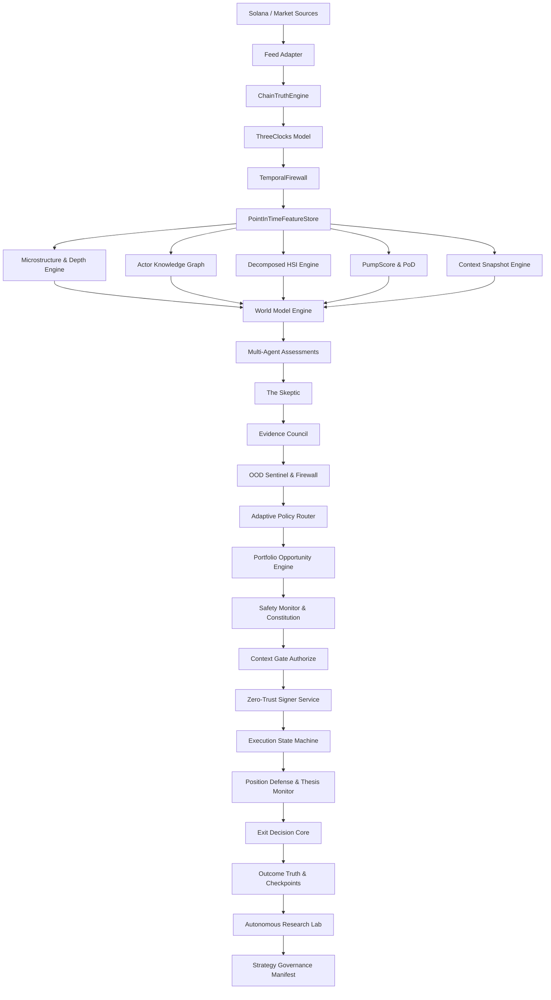

# SOL-SYLPH — System Dependency Graph & Contract Specification
*Generated as Mandatory Deliverable #4 pursuant to Section 2 of the Intelligence Fabric Master Specification.*

---

## 1. Upstream to Downstream Subsystem Graph

---

## 2. Producer-Consumer Contracts & Degradation Matrix

| Component | Producer | Consumer | Data Schema | Failure / Degradation Behavior |
| :--- | :--- | :--- | :--- | :--- |
| **Feed Adapter** | External WS/RPC | `ChainTruthEngine` | Raw WS frame / JSON | Exponential backoff reconnect; alerts on 429 |
| **ChainTruthEngine** | Feed Adapter | `ThreeClocks`, `TemporalFirewall` | `CanonicalEvent` | Reorg triggers forensic rollback; retains historical audit |
| **ThreeClocks** | Solana slot / System clock | All engines | `ThreeClocksSnapshot` | Falls back to monotonic tick if slot lag exceeds threshold |
| **TemporalFirewall** | `ChainTruthEngine` | `PointInTimeFeatureStore` | `InformationArtifact` | Throws `TemporalLeakageError`; completely blocks lookahead |
| **PointInTimeFeatureStore** | `TemporalFirewall` | Feature extractors | `FeatureSnapshot` (SHA-256) | Zero future feature exposure; snapshot immutable |
| **ActorKnowledgeGraph** | Trade history | `WorldModelEngine`, Council | `ActorClusterNode` | Degrades to individual wallet nodes if lineage unknown |
| **MicrostructureDepth** | Bonding curve ticks | `WorldModelEngine`, `Exitability` | `DepthProfile`, $PriceImpact(size)$ | Uses linear approximation if depth curve has $< 3$ points |
| **WorldModelEngine** | Signals & Features | Agents, Council | `WorldModelForecast` | Widens distribution uncertainty bounds during volatility |
| **The Skeptic** | Trade theses | `EvidenceCouncil` | `ChallengeReport` | Vetoes trade thesis if manipulability cost $< 0.2$ SOL |
| **EvidenceCouncil** | Agents & Skeptic | `AdaptivePolicyRouter` | `EvidenceCouncilVerdict` | Halts execution and forces `ABSTAIN` on logical contradiction |
| **OODSentinel** | Novelty engines | `ContextGate` | Epistemic state (`KNOWN` to `UNKNOWN`) | Restricts capital allocation; forces `OBSERVE_ONLY` if OOD |
| **SafetyMonitor** | System invariants | `ContextGate` | `SafetyMonitorVerdict` | Fail-closed: locks new capital authority on any violation |
| **ContextGate** | Risk, Safety, Quotes | `ZeroTrustSignerService` | `DecisionAuthorization` | Requotes or aborts if quote age $> 1500\text{ms}$ or route stale |
| **PositionDefense** | Live price ticks | `ExitDecisionCore` | `PositionDefenseState`, D0–D5 | Invalidation triggers immediate de-risking ladder |
| **AutonomousLab** | Historical episodes | `StrategyGovernance` | `ResearchProposal` | Throttled when P0–P2 load $> 0.75$; never directly trades |
