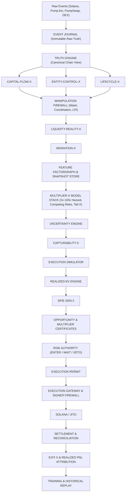

# SYLPH FUSION — MULTIPLIER-X GEN-2
## Integrated Extreme-Runner Intelligence, Capturability, Execution, and Tail-Risk Blueprint

### 0. PRIMARY MISSION
Transform MULTIPLIER-X from a generic “runner detector” into a complete rare-event trading intelligence system answering:
> *Which Solana/Pump.fun token has a sufficiently high probability of reaching 2×–100×+, for economically real and independently verifiable reasons, early enough for SYLPH to enter, with enough executable liquidity to realize the expected gain, while maintaining acceptable collapse, manipulation, rug, execution, and liquidity-failure risk?*

MULTIPLIER-X must predict:
* whether a multiple will occur;
* when it may occur;
* how long it may persist;
* whether it is capital-backed;
* whether it is manipulation-backed;
* whether entry is still timely;
* whether SYLPH can execute entry;
* whether SYLPH can exit;
* how much of the apparent multiple is realizable;
* expected PnL after costs;
* expected downside;
* catastrophic-tail probability;
* uncertainty;
* whether evidence is sufficient to trade.

The production objective is:
$$P(\text{Capturable Multiple} \ge m, T \le t, \text{Realizable}, \text{Risk Acceptable} \mid X_t)$$
not:
$$P(\text{token pumps})$$

---

### 1. CORE PRINCIPLES
* **1.1 Price is not capital**: A price increase can occur without significant economic inflow. $\text{PriceMultiplier} \neq \text{CapitalBackedMultiplier}$.
* **1.2 Wallet count is not entity count**: Multiple wallets may belong to one controlling entity. $\text{WalletCount} \neq \text{IndependentParticipants}$.
* **1.3 Volume is not demand**: Gross volume includes wash trading, atomic round trips, tx padding, and recycled capital. $\text{GrossVolume} \neq \text{OrganicDemand}$.
* **1.4 Migration is not success**: Migration is a lifecycle transition, not an automatic runner or profitable exit. $\text{Migration} \neq \text{BUY}$.
* **1.5 Chart high is not realizable return**: $\text{DisplayedPeak} \neq \text{ExecutablePeak} \neq \text{RealizablePeak}$.
* **1.6 Missing observation is not failure**: $\text{UNKNOWN} \neq \text{DEAD}$, $\text{RIGHT\_CENSORED} \neq \text{NEGATIVE}$, $\text{LOST\_TO\_FOLLOWUP} \neq \text{FAILURE}$.
* **1.7 Manipulation is not always an immediate veto**: Manipulation must be modeled. Expanding external capital with deepening liquidity differs from 100% artificial volume.
* **1.8 Prediction without execution modeling is incomplete**: A 100× token that SYLPH cannot enter or exit profitably is irrelevant to production trading.

---

### 2. TARGET ARCHITECTURE


---

### 3. MISSING CONNECTING SPINE: NEXUS-MX
Links every event from discovery to settlement through an immutable lineage:
`RawEvent -> CanonicalEvent -> TokenEpisode -> FeatureSnapshot -> ModelSnapshot -> RiskSnapshot -> ExecutionSnapshot -> Certificate -> Decision -> Permit -> Order -> Settlement -> Outcome`

Common Lineage Attributes:
* `token_episode_id`
* `event_journal_offset`
* `canonical_snapshot_id`
* `feature_snapshot_id`
* `model_generation`
* `configuration_epoch`
* `risk_epoch`
* `execution_generation`
* `certificate_id`
* `decision_id`
* `execution_permit_id`
* `order_attempt_id`
* `settlement_id`

---

### 4. EVENT JOURNAL
Append-only log for all external and internal feeds:
```typescript
interface JournalEnvelope {
  journalId: string;
  source: string;
  receivedAt: number;
  sourceTimestamp?: number;
  slot?: number;
  signature?: string;
  mint?: string;
  pool?: string;
  wallet?: string;
  schemaVersion: string;
  payloadHash: string;
  payload: unknown;
}
```

---

### 5. TRUTH ENGINE
Converts raw observations into verified canonical dimensions:
* `CanonicalTokenState`
* `CanonicalPoolState`
* `CanonicalWalletState`
* `CanonicalCurveState`
* `CanonicalMigrationState`
* `CanonicalExecutionState`

---

### 6. OBSERVATION INTEGRITY: OUTCOME-ASCERTAINMENT-X
Observation statuses: `FULLY_OBSERVED`, `PARTIALLY_OBSERVED`, `RIGHT_CENSORED`, `LOST_TO_FOLLOWUP`, `DATA_GAP`, `SOURCE_CONFLICT`, `TERMINAL_STATE_CONFIRMED`.
```typescript
interface OutcomeObservationCertificate {
  tokenEpisodeId: string;
  firstObservedAt: number;
  lastObservedAt: number;
  firstObservedSlot: number;
  lastObservedSlot: number;
  observationStatus: string;
  sourceCoverage: string[];
  gapDurationMs: number;
  graduationVerified: boolean;
  collapseVerified: boolean;
  terminalEvidence?: string[];
  confidence: number;
}
```

---

### 7. TOKEN EPISODE
Canonical lifecycle atomic unit for replay, training, and audits:
```typescript
interface TokenEpisode {
  id: string;
  mint: string;
  createdAt: number;
  createdSlot: number;
  discoveredAt: number;
  creator: string;
  lifecycle: LifecycleTimeline;
  capital: CapitalTimeline;
  participants: EntityTimeline;
  liquidity: LiquidityTimeline;
  manipulation: ManipulationTimeline;
  execution: ExecutionTimeline;
  outcomes: OutcomeTimeline;
}
```

---

### 8–10. CAPITAL-FLOW-X & CAPITAL ORIGIN GRAPH
* Separates: `GrossVolume` vs `OrganicBuySOL`, `OrganicSellSOL`, `OrganicNetSOL`, `NewCapitalSOL`, `RecycledCapitalSOL`, `WhaleCapitalSOL`, `RetailCapitalSOL`, `ClusterAdjustedCapitalSOL`.
* Metrics: `CapitalVelocity`, `CapitalAcceleration`, `CapitalJerk`, `CapitalPersistence`, `CapitalRetention`, `CapitalConcentration`.
* Origin Graph: Computes `FreshCapitalRatio`, `RecycledCapitalRatio`, `CreatorFundedRatio`, `ExternalCapitalRatio`.
* Capital-Backed Multiplier:
  $$\text{CBM} = \frac{\text{economically-supported price}}{\text{entry price}}$$
  Strictly separates: $\text{DisplayedPriceMultiple} \neq \text{CapitalBackedMultiple} \neq \text{ExecutableMultiple} \neq \text{RealizableMultiple}$.

---

### 11–13. ENTITY-CONTROL-X & SERVICE-WALLET EXCLUSION
* Maps wallets to controllers via funding clusters and behavior.
* Features: `EffectiveIndependentBuyers`, `CreatorClusterSize`, `Top1ControllerSupply`, `Top3ControllerSupply`, `ControllerEntropy`, `ControllerGini`, `CoordinatedInventory`, `PotentialDumpInventory`.
* Service Entity Registry filters out exchanges, bridges, routers, and relayers to prevent false clustering.

---

### 14–20. MANIPULATION FIREWALL
Unified `ManipulationVector`:
```typescript
interface ManipulationVector {
  washProbability: number;
  atomicSelfCancelProbability: number;
  bundlerProbability: number;
  txPaddingProbability: number;
  lpiProbability: number;
  coordinatedDumpProbability: number;
  creatorSybilProbability: number;
  fundingClusterProbability: number;
  volumeAuthenticity: number;
  participationAuthenticity: number;
  manipulationConfidence: number;
}
```
* **Wash-X**: Detects round trips and closed loops; outputs `WashAdjustedVolume`.
* **Atomic-Self-Cancel-X**: Detects within-transaction buy+sell wash loops.
* **Tx-Padding-X**: Detects micro-trade count padding; outputs `TxPaddingRatio`.
* **Bundler-X**: Identifies synchronized multi-wallet buys from shared funding roots.
* **Coordinated-Dump-Hazard-X**: Tracks inventory consolidation into dumpers before selloff.
* **LPI-X**: Liquidity Pool Price Inflation detector measuring:
  $$\text{CapitalEfficiencyOfMove} = \frac{\log(P_t/P_0)}{\max(\text{NetOrganicQuoteInflow}, \epsilon)}$$
  $$\text{AMMExplainedFraction} = \frac{\text{reserve-model predicted move}}{\text{observed move}}$$

---

### 21–22. LIQUIDITY-REALITY-X & EXITABILITY-X
* Realizable curves: Computes expected realized multiple across position sizes ($100, $500, $1k, $5k, $10k).
* Depth at 1%, 2%, 5%, 10%, 20%; `RouteRedundancy`, `LiquidityDecay`.
* `ExitabilityScore`: Derived from available routes, pool reserves, price impact, LP concentration, network contention, and quote reliability. Vetoes entries with high theoretical upside but inadequate exit depth.

---

### 23–25. LIFECYCLE-X & MIGRATION-X
* Lifecycle states: `DISCOVERED`, `EARLY_CURVE`, `CURVE_EXPANSION`, `CURVE_ACCELERATION`, `NEAR_MIGRATION`, `MIGRATING`, `POST_MIGRATION`, `EXPANSION`, `MATURE`, `DISTRESSED`, `COLLAPSING`, `DEAD`.
* Migration Regime Classification: `ORGANIC`, `CAPITAL_ACCELERATED`, `WASH_ACCELERATED`, `WHALE_DRIVEN`, `CONTROLLER_DOMINATED`, `LOW_LIQUIDITY`, `MANIPULATED`, `UNCERTAIN`.
* Evaluates $P(10\times \mid \text{migration state + conditions})$, never unconditionally on migration.

---

### 26–28. FACTORGRAPH & FEATURE LINEAGE
* Shared canonical DAG preventing duplicate or conflicting calculations.
* Every feature carries immutable lineage: `feature_name`, `feature_version`, `calculation_version`, `data_sources`, `source_slots`, `watermark`, `observation_time`, `confidence`.
* Multi-timeframe derivatives computed across: 1s, 5s, 10s, 30s, 1m, 3m, 5m, 10m, 30m, 1h.

---

### 29–36. MULTIPLIER-X MODEL STACK & COMPETING RISKS
* Discrete barrier targets: `Touch2x`, `Touch3x`, `Touch5x`, `Touch10x`, `Touch20x`, `Touch50x`, `Touch100x`.
* Probability surface: $P(M \ge m, T \le t)$.
* Competing hazard functions:
  $$\lambda_{\text{runner}}(t) \quad \text{vs} \quad \lambda_{\text{collapse}}(t), \lambda_{\text{rug}}(t), \lambda_{\text{liquidity}}(t), \lambda_{\text{manipulation}}(t), \lambda_{\text{migration}}(t)$$
* **Collapse-X**: Predicts $P(\text{drawdown} > 20\%, 40\%, 60\%, 80\%)$ across horizons.
* **Tail-X**: Hierarchical conditioning:
  $$P(2\times) \to P(5\times \mid 2\times) \to P(10\times \mid 5\times) \to P(20\times \mid 10\times) \to P(50\times \mid 20\times) \to P(100\times \mid 50\times)$$
* **Uncertainty-X**: Decomposes into `EpistemicUncertainty`, `AleatoricUncertainty`, `DataQualityUncertainty`, `RegimeUncertainty`.

---

### 37–40. CAPTURABILITY-X, EXECUTION SIMULATION & REALIZED EV
* Evaluates latency (detection, signal, quote, signer, submission, confirmation) against liquidity depth, Jito tips, and priority fees.
* Realizable Multiplier for size $q$:
  $$RM(q) = \frac{\text{ExecutableExitValue}(q) - \text{Costs}}{\text{ExecutableEntryCost}(q)}$$
* Realized EV calculation:
  $$\text{EV} = \sum_i P(O_i) \cdot \text{PnL}(O_i) - \text{Costs} - \text{TailRiskAdjustment}$$

---

### 41–44. SPIE GEN-2 & CERTIFICATES
```typescript
interface SPIEOutput {
  expectedValueSol: number;
  confidence: number;
  uncertainty: number;
  upsideExpected: number;
  downsideExpected: number;
  realizedMultiplierExpected: number;
  collapseProbability: number;
  rugProbability: number;
  liquidityFailureProbability: number;
  executionFailureProbability: number;
  invalidationConditions: string[];
}
```
* **MultiplierCertificate**: Immutable signed certificate binding observation, capital flow, entity control, liquidity reality, manipulation vector, Multiplier-X probabilities, tail risk, and execution bounds.

---

### 45–50. RISK AUTHORITY & EXIT INTELLIGENCE (EXIT-X)
* Strict separation between **Hard Safety Vetoes** (cannot be overridden: unverified mint/freeze, no exit route, stale state) and **Statistical Risk Penalties** (reduce EV).
* Position Sizing bounded by depth, slippage, portfolio limits, and Kelly criteria.
* Continuous Position Intelligence: Multiplier-X continues recomputing throughout position lifecycle to support barrier-aware trailing and structural exits.

---

### 51–65. EMPIRICAL VALIDATION & OBSERVABILITY
* Chronological walk-forward validation (older train $\to$ middle validation $\to$ future unseen test) with purged time splits and zero random-shuffle lookahead.
* Production Authority Ladder: `OFFLINE -> REPLAY -> SHADOW -> SIM -> PAPER -> LIMITED_LIVE -> FULL_LIVE`.
* Full event-stream historical replay engine.
* UI Panels: Multiplier-X, Capital Flow, Entity Control, Liquidity Reality, Manipulation, Lifecycle, and "Why / Invalidation" evidence drawer.

---

### 91. MANDATORY PRODUCTION INVARIANTS
1. `UNKNOWN != FAILURE`
2. `MIGRATION != SUCCESS`
3. `DISPLAYED_PEAK != REALIZABLE_PEAK`
4. `WALLET_COUNT != ENTITY_COUNT`
5. `GROSS_VOLUME != ORGANIC_VOLUME`
6. `PRICE_MOVE != ECONOMIC_CAPITAL`
7. `MODEL != EXECUTION_AUTHORITY`
8. `CERTIFICATE_EXPIRED => NO_ENTRY`
9. `UNRECONCILED_POSITION => NO_INCREASE`
10. `STALE_DATA => NO_ENTRY`
